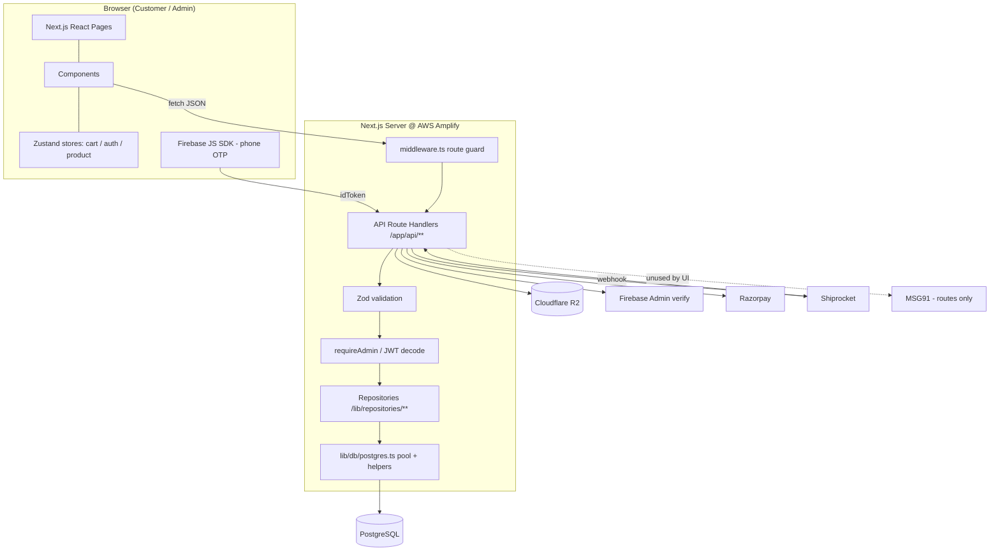
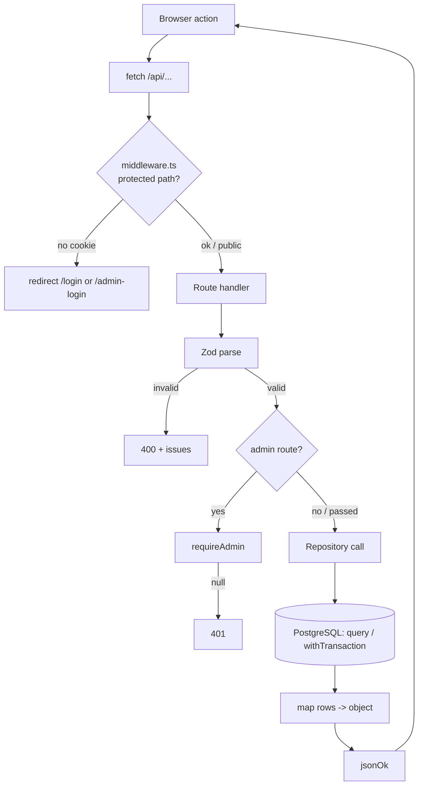
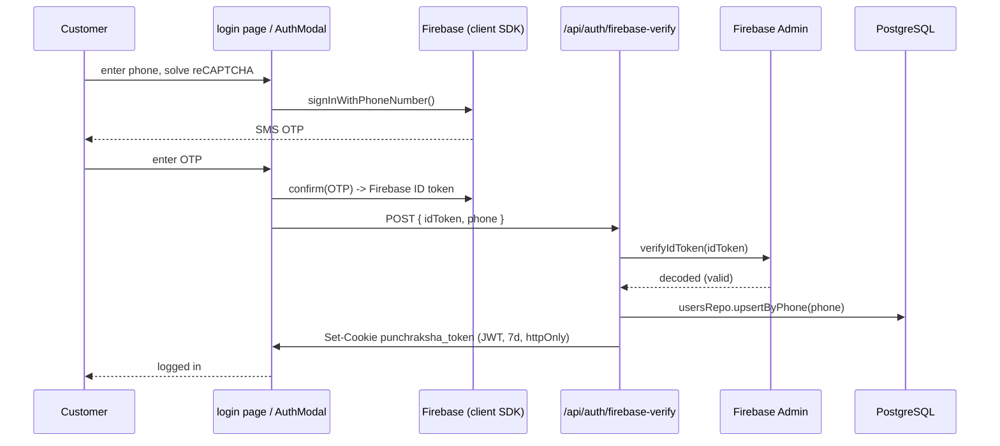
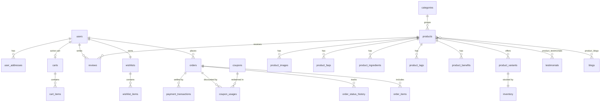
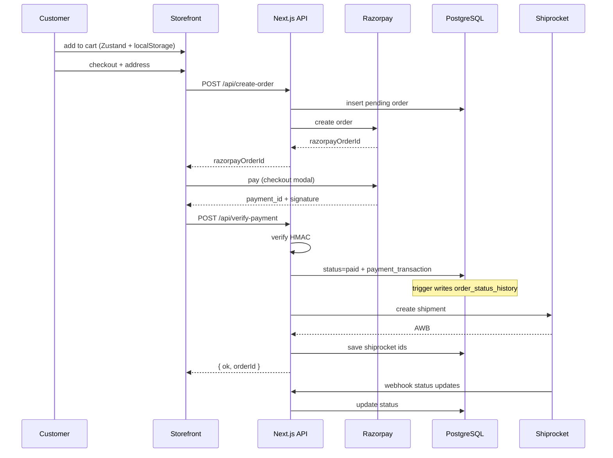

# PunchRaksha — Technical Handover & Codebase Audit

**Audience:** A new developer taking over the project with **no prior knowledge transfer.**
**Method:** This document was produced by recursively scanning the actual source tree, reading the code, and following imports. Where claims could not be verified in code, they are marked. Where code contradicts existing docs, the contradiction is called out explicitly.

---

## 0. Key Findings & Discrepancies (read first)

These are non-obvious facts discovered during the audit that materially affect how you work on this project:

1. **Active customer auth is Firebase Phone OTP, not MSG91.**
   - `app/login/page.tsx` and `components/layout/cart-drawer/AuthModal.tsx` use Firebase `signInWithPhoneNumber` (+ reCAPTCHA), then POST the Firebase ID token to `/api/auth/firebase-verify`, which verifies it with `firebaseAdmin` and issues the JWT cookie.
   - The MSG91 routes (`/api/otp/send`, `/verify`, `/resend`) exist but **no UI component calls them** (verified by search). They appear to be a partially-completed migration target.
   - **This is the opposite of what `CLAUDE.md` and the old README stated.** Trust the code.

2. **The previous `README.md` was stale and unsafe.** It described MongoDB/Mongoose/Firebase-only, and **hard-coded live admin credentials**. It has been replaced with an accurate, secret-free version. Rotate those credentials if they were ever committed publicly.

3. **No ORM.** Data access is a hand-rolled **repository layer** over the `pg` driver. There is no Prisma/Sequelize/TypeORM — do not look for schema models; the source of truth is `scripts/schema.sql`.

4. **No Docker, no CI config files, no `amplify.yml` in-repo.** Deployment is configured in the AWS Amplify console (build = `npm run build`). There are no `Dockerfile`, `docker-compose`, `.github/workflows`, or `vercel.json` files.

5. **`ShiprocketProvider` is commented out** in `app/layout.tsx` — the client-side Shiprocket script is currently disabled. Shipping still works server-side via the API routes.

6. **Several legacy/unused artifacts exist** — see §18 (Unused / Legacy Inventory).

---

## 1. What This Project Does

PunchRaksha is a production e-commerce platform for Ayurvedic products. It provides a storefront, shopping/checkout with online + COD payments, customer accounts via phone OTP, automated shipping, customer reviews, a CMS (blogs + dynamic content pages), and a full admin back-office with operational logging (audit, activity, notifications, abandoned carts).

---

## 2. Complete Architecture Overview



**Layering:** Presentation (`app` pages + `components`) → Orchestration (`app/api` route handlers) → Data (`lib/repositories` → `lib/db/postgres.ts` → PostgreSQL). External services are encapsulated in `lib/` modules.

---

## 3. Full Folder Structure

```
punchraksha_clean/
├── app/
│   ├── layout.tsx                  # root layout: fonts, metadata, (ShiprocketProvider commented out)
│   ├── page.tsx                    # home page
│   ├── [slug]/                     # dynamic content-page renderer
│   ├── about/ contact/ faq/ bulk-order/
│   ├── privacy-policy/ refund-policy/ terms/
│   ├── all-products/ products/     # catalogue listings
│   ├── product/[slug]/             # product detail page
│   ├── blog/ blog/[slug]/          # blog list + post
│   ├── testimonial/                # testimonials page
│   ├── login/                      # customer login (Firebase OTP) — ACTIVE auth UI
│   ├── order-success/              # post-payment confirmation
│   ├── account/                    # protected: account + account/orders + [id]
│   ├── dashboard/                  # protected: dashboard + orders + addresses
│   ├── admin-login/                # admin sign-in page
│   ├── admin/                      # protected admin back-office (products, blogs, content,
│   │                               #   orders, reviews, testimonials, settings)
│   ├── sitemap.ts / robots.ts      # SEO
│   └── api/                        # ===== BACKEND ===== (see §10 for full list)
│       ├── admin/**                # guarded CRUD + upload + logs
│       ├── auth/**                 # firebase-verify, dev-login, logout, shiprocket-login
│       ├── otp/**                  # MSG91 send/verify/resend (UI-unused)
│       ├── create-order/ verify-payment/   # Razorpay lifecycle
│       ├── shiprocket/** webhooks/**       # shipping + inbound webhook
│       └── products/ blog/ reviews/ cart/ wishlist/ user/ orders/
│           testimonials/ apply-coupon/ activity/
│
├── components/
│   ├── admin/                      # ProductForm, BlogForm, ContentForm, GenericTabEditor, SortableImage
│   ├── checkout/                   # AddressForm, OrderSummary, PaymentSection
│   ├── common/                     # SafeImage
│   ├── home/                       # Hero, BestSelling, ProductSlider, Testimonials, Badges, CTA, etc.
│   ├── layout/                     # Navbar, Footer, AnnouncementBar, CartDrawer
│   │   └── cart-drawer/            # AuthModal, AddressList, AddAddressForm, Checkout*/PaymentOffers
│   ├── product/                    # ProductHero, ProductTabs, CustomerReviews, StickyBar, Badges, Testimonials
│   ├── providers/                  # ShiprocketProvider (commented out in layout)
│   └── ui/                         # Button(+Base/Secondary), Badge, ProductCard, StarRating, Accordion,
│                                   #   Loader, GlareHover, InlineImage
│
├── lib/
│   ├── auth.ts                     # JWT sign/verify, cookie set/clear, OTP HMAC
│   ├── auth/authStore.ts           # Zustand auth store (client)
│   ├── cart/cartStore.ts           # Zustand cart store (persisted)
│   ├── cart/useAddToCart.ts        # add-to-cart hook
│   ├── store/productStore.ts       # Zustand product cache
│   ├── db/postgres.ts              # pg Pool singleton + query/one/rows/withTransaction
│   ├── repositories/               # 19 repos + _mappers.ts (data access — see §6)
│   ├── r2/client.ts                # Cloudflare R2 upload helpers
│   ├── razorpay.ts                 # Razorpay client init
│   ├── shiprocket/auth.ts          # Shiprocket token management
│   ├── shiprocket/shiprocketService.ts  # ShiprocketService class
│   ├── firebase/client.ts          # Firebase web SDK init (ACTIVE — login UI)
│   ├── firebase/admin.ts           # Firebase Admin init (ACTIVE — firebase-verify)
│   └── utils/                      # api, adminAuth, audit, validators, discountCalc,
│                                   #   formatPrice, loadScript, seo
│
├── scripts/
│   ├── schema.sql                  # full PostgreSQL schema (source of truth)
│   ├── apply-schema.ts             # applies schema.sql to DATABASE_URL
│   ├── apply-migration.ts          # applies a single migration file
│   ├── migrations/001..007_*.sql   # phased schema evolution
│   ├── ensure-order-partitions.ts  # provisions future monthly order partitions
│   ├── seed-admin.ts               # registers a DB admin (role='admin')
│   ├── seed-safed-musli.ts         # seeds one product + reviews
│   ├── migrate-images-to-r2.ts     # one-off: move images to R2
│   ├── repair-db-images.js         # one-off: fix DB image URLs
│   ├── repair-static-images.js     # one-off: fix static image refs
│   └── _placeholderLib.js          # placeholder helper (appears unused — see §18)
│
├── middleware.ts                   # edge route protection
├── next.config.mjs                 # image-host whitelist (R2), Next config
├── tsconfig.json                   # path alias "@/*" → project root
├── package.json / package-lock.json
├── .gitignore                      # ignores .env*, node_modules, backups, etc.
├── .env                            # secrets (gitignored)
└── docs/                           # documentation
```

---

## 4. Folder-by-Folder Explanation

### `app/` — Pages & API
- **Purpose:** Routing for both UI (`page.tsx`) and backend (`api/**/route.ts`).
- **Responsibility:** Server-render pages; handle all HTTP API requests.
- **Relationships:** Pages compose `components/`; API routes call `lib/` (repositories, auth, integrations).

### `app/api/` — Backend
- **Purpose:** The entire server API. Each subfolder = a REST resource.
- **Responsibility:** Validate (Zod) → authorize (`requireAdmin`/JWT) → orchestrate → call repositories → return JSON via `jsonOk/jsonBad`.
- **Relationships:** Depends on `lib/repositories`, `lib/utils/api`, `lib/utils/adminAuth`, `lib/auth`, and integration modules.

### `components/` — UI
- **Purpose:** All React components, grouped by surface (admin/checkout/home/layout/product/ui/common/providers).
- **Responsibility:** Presentation + interaction; call APIs via `fetch`; read/write Zustand stores.
- **Relationships:** Used by `app/` pages; `AuthModal` and `login` depend on `lib/firebase/client`.

### `lib/` — Logic & Infrastructure
- **Purpose:** Keep route handlers thin; centralize auth, DB access, integrations, utilities.
- **Relationships:** `repositories` depend on `db/postgres`; API routes depend on everything here.

### `lib/repositories/` — Data Access Layer
- **Purpose:** The **only** place SQL is written. One module per entity.
- **Responsibility:** Map DB rows ↔ application objects (Mongo-style `_id`), run parameterized queries/transactions.

### `scripts/` — DB & Maintenance
- **Purpose:** Create/upgrade DB, seed data, one-off repairs.
- **Run with:** `npx tsx scripts/<file>.ts` (TypeScript) or `node` (the `.js` repair scripts).

### `components/providers/`
- **Purpose:** App-wide providers. Currently only `ShiprocketProvider`, **disabled** (commented in `app/layout.tsx`).

---

## 5–6. File-by-File Documentation (important files)

> Format: **Purpose / Depends on / Depended on by / Business logic / Where used.**

### Infrastructure

**`lib/db/postgres.ts`**
- *Purpose:* Single DB connection point.
- *Exports:* `getPool()` (cached singleton `Pool`, max 10, SSL auto for non-local), `query()`, `rows()`, `one()`, `withTransaction()`.
- *Depends on:* `pg`, `DATABASE_URL`.
- *Depended on by:* every repository.
- *Business logic:* transaction wrapper (BEGIN/COMMIT/ROLLBACK); does not throw at import-time so `next build` works without a DB.

**`lib/auth.ts`**
- *Purpose:* Auth primitives.
- *Exports:* `signAuthToken()` (7-day JWT), `setAuthCookie()`/`clearAuthCookie()` (httpOnly, SameSite=Lax, secure in prod), `getAuthFromRequestCookie()` (verify+decode), `hashOtp()` (HMAC-SHA256).
- *Depends on:* `jsonwebtoken`, `crypto`, Next `cookies()`, `NEXT_PUBLIC_JWT_SECRET`/`JWT_SECRET` (with a hard-coded fallback secret — see §13).
- *Depended on by:* `firebase-verify`, `dev-login`, `admin/auth/login`, `logout`, `otp/verify`, `adminAuth`.

**`lib/utils/api.ts`** — `jsonOk`, `jsonBad`, `jsonZodError`. Used by virtually all API routes.

**`lib/utils/adminAuth.ts`** — `requireAdmin()`: grants access to the env-admin (token role admin + matching email) **or** any DB user with `role='admin'`. Depends on `lib/auth`, `user.repository`. Used at the top of every `admin/*` route.

**`lib/utils/validators.ts`** — central Zod schemas (e.g. `phoneSchema`). Used by OTP/user/order routes.

**`lib/utils/audit.ts`** — writes `audit_logs` entries for admin actions.

**`lib/utils/discountCalc.ts` / `formatPrice.ts` / `loadScript.ts` / `seo.ts`** — discount math; INR formatting; dynamic Razorpay SDK loader; SEO metadata helpers.

### Authentication files

**`lib/firebase/client.ts`** — initializes the Firebase web SDK from `NEXT_PUBLIC_FIREBASE_*`. *Depended on by:* `app/login/page.tsx`, `AuthModal.tsx`. **ACTIVE.**

**`lib/firebase/admin.ts`** — initializes Firebase Admin (service account). *Depended on by:* `app/api/auth/firebase-verify/route.ts`. **ACTIVE.**

**`app/api/auth/firebase-verify/route.ts`** — POST: verifies a Firebase ID token via `firebaseAdmin.auth().verifyIdToken()`, `usersRepo.upsertByPhone(phone)`, then `signAuthToken` + `setAuthCookie`. **This is the live customer login backend.**

**`app/api/auth/dev-login/route.ts`** — POST: development bypass (returns 403 unless `NEXT_PUBLIC_NODE_ENV === 'development'`); upserts by phone and issues a JWT. Used as a fallback in `AuthModal`.

**`app/api/admin/auth/login/route.ts`** — POST: compares email/password to env vars; issues JWT with `role:'admin'` via a raw `Set-Cookie` header (to survive Amplify CloudFront).

**`app/api/otp/{send,verify,resend}/route.ts`** — MSG91 OTP endpoints. `verify` upserts the user and issues a JWT. **Not referenced by any UI (unused front-end path).**

### Payments & shipping

**`lib/razorpay.ts`** — Razorpay client init from `NEXT_PUBLIC_RAZORPAY_KEY_ID`/`_SECRET` (falls back to `RAZORPAY_KEY_SECRET`).

**`app/api/create-order/route.ts`** — POST: creates a Razorpay order and a pending DB order.

**`app/api/verify-payment/route.ts`** — POST: recomputes the Razorpay HMAC signature; on match sets order `status='paid'` and records a captured `payment_transaction`; on mismatch records a failed transaction and returns 400.

**`lib/shiprocket/auth.ts`** — manages the Shiprocket auth token (`SHIPROCKET_EMAIL`/`PASSWORD`).

**`lib/shiprocket/shiprocketService.ts`** — `ShiprocketService` class: `createAdhocOrder`, `assignAWB`, `generatePickup`, `trackShipment`, `printInvoice`.

**`app/api/shiprocket/*` & `app/api/webhooks/shiprocket/order/route.ts`** — shipment creation/AWB/tracking + inbound status webhook.

### Storage

**`lib/r2/client.ts`** — `uploadToR2`, `buildKey`, `isAllowedImage`, `MAX_UPLOAD_BYTES` (8 MB). Used by `app/api/admin/upload/route.ts`.

### Repositories (`lib/repositories/`)

One module per entity, all depending on `lib/db/postgres.ts` and `_mappers.ts`:

| Repository | Backing table(s) | Notable functions |
|---|---|---|
| `product.repository` | products + product_* | `create`, `findBySlug`, `findById`, list/filter, hydrates normalized arrays |
| `order.repository` | orders, order_items | `create`, `findById`, `updateByRazorpayId`, `updateStatus` |
| `user.repository` | users, user_addresses | `upsertByPhone`, `findById`, `findByPhone`, `updateById`, address CRUD |
| `review.repository` | reviews | create/list/moderate (rating aggregate handled by DB trigger) |
| `coupon.repository` / `couponUsage.repository` | coupons / coupon_usages | validate, record redemption |
| `category.repository` | categories | CRUD |
| `inventory.repository` | inventory | stock read/update |
| `paymentTransaction.repository` | payment_transactions | `record` (append-only) |
| `orderStatusHistory.repository` | order_status_history | read history |
| `blog.repository` / `contentPage.repository` / `testimonial.repository` | blogs / content_pages / testimonials | CMS CRUD |
| `cart.repository` / `wishlist.repository` | carts/cart_items / wishlists/wishlist_items | server-side cart & wishlist |
| `customerActivity.repository` / `notificationLog.repository` / `auditLog.repository` | *_logs | operational logging |
| `siteSettings.repository` | site_settings | global settings |

**`_mappers.ts`** — shared helpers (`num`, `date`, `sortClause`, `Lean` type) used by all repos.

### Front-end notable files

**`app/layout.tsx`** — root layout; fonts (Outfit + REM); global metadata (`metadataBase` = punchraksha.com; **`robots: { index:false }` — flip before go-live**); `ShiprocketProvider` import + render **commented out**.

**`app/login/page.tsx`** — customer login via Firebase phone OTP + reCAPTCHA → `/api/auth/firebase-verify`.

**`components/layout/cart-drawer/AuthModal.tsx`** — in-cart login (same Firebase flow + `dev-login` fallback).

**`components/admin/ProductForm.tsx`** — product editor; image gallery drag-reorder via `@dnd-kit`; uploads through `/api/admin/upload`.

**`middleware.ts`** — redirects unauthenticated requests away from `/account`, `/dashboard`, `/admin` (excluding `/admin-login` and `/api/admin/auth`).

**`next.config.mjs`** — whitelists R2 image hosts (`*.r2.dev`, `*.r2.cloudflarestorage.com`, `R2_PUBLIC_BASE_URL` host) for `next/image`.

---

## 7. How Requests Flow



In Next.js the **route handler is the controller**; the **repository is the service/data layer**.

---

## 8. How Authentication Works



- **Session:** stateless JWT in the `punchraksha_token` httpOnly cookie (7-day expiry).
- **Admin:** `/api/admin/auth/login` compares email/password to env vars → JWT with `role:'admin'`.
- **Dev bypass:** `/api/auth/dev-login` (only when `NEXT_PUBLIC_NODE_ENV === 'development'`).
- **MSG91 path:** implemented server-side but not wired to UI.

## 9. How Authorization Works

| Surface | Guard | Rule |
|---|---|---|
| `/account/*`, `/dashboard/*` | `middleware.ts` | redirect to `/login` if no cookie |
| `/admin/*` (except `/admin-login`) | `middleware.ts` | redirect to `/admin-login` if no cookie |
| `/api/admin/*` | `requireAdmin()` in each handler | env-admin **or** DB user with `role='admin'`; else 401 |
| Customer endpoints | `getAuthFromRequestCookie()` | decode JWT → `userId` |

Roles: **guest**, **customer** (`users.role='customer'`), **admin** (`users.role='admin'` or env-admin).

---

## 10. API Reference (auto-discovered, with HTTP methods)

> Methods below are read directly from each `route.ts`. All `admin/*` require an admin session. Standard error shape: `{ "error": "message" }`.

### Public / storefront
| Endpoint | Methods | Purpose |
|---|---|---|
| `/api/products` | GET | List/fetch products |
| `/api/blog` | GET | List blog posts |
| `/api/testimonials` | GET | Homepage testimonials |
| `/api/reviews` | POST | Submit a review |
| `/api/apply-coupon` | POST | Validate a coupon |
| `/api/activity` | POST | Log a customer activity event |

### Cart / wishlist / user (customer)
| Endpoint | Methods | Purpose |
|---|---|---|
| `/api/cart` | GET, POST, PATCH, DELETE | Server-side cart ops |
| `/api/wishlist` | GET, POST, DELETE | Wishlist ops |
| `/api/user` | GET, PATCH | Profile read/update |
| `/api/user/addresses` | GET, POST | List/add addresses |
| `/api/user/addresses/[id]` | PUT, PATCH, DELETE | Modify/remove an address |
| `/api/user/phone` | POST, PATCH | Update phone (MSG91) |
| `/api/orders` | GET | Customer order list |
| `/api/orders/[id]` | GET, PATCH | Order detail / update |

### Auth
| Endpoint | Methods | Purpose |
|---|---|---|
| `/api/auth/firebase-verify` | POST | **Active** customer login (verify Firebase token → JWT) |
| `/api/auth/dev-login` | POST | Dev-only login bypass |
| `/api/auth/logout` | GET | Clear session cookie |
| `/api/auth/shiprocket-login` | POST | Shiprocket auth helper |
| `/api/otp/send` | POST | MSG91 send (UI-unused) |
| `/api/otp/verify` | POST | MSG91 verify → JWT (UI-unused) |
| `/api/otp/resend` | POST | MSG91 resend (UI-unused) |

### Payments & shipping
| Endpoint | Methods | Purpose |
|---|---|---|
| `/api/create-order` | POST | Create Razorpay + pending DB order |
| `/api/verify-payment` | POST | Verify signature → mark paid |
| `/api/shiprocket/create-order` | POST | Create shipment |
| `/api/shiprocket/assign-awb` | POST | Assign courier/AWB |
| `/api/shiprocket/track` | GET | Track shipment |
| `/api/shiprocket/checkout-token` | POST | Shiprocket checkout token |
| `/api/shiprocket/catalog/products` | GET | Shiprocket catalog products |
| `/api/shiprocket/catalog/collections` | GET | Shiprocket catalog collections |
| `/api/webhooks/shiprocket/order` | POST | Inbound status webhook |

### Admin (guarded)
| Endpoint | Methods |
|---|---|
| `/api/admin/auth/login` | POST |
| `/api/admin/products` | GET, POST |
| `/api/admin/products/[slug]` | GET, PUT, DELETE |
| `/api/admin/products/[slug]/clone` | POST |
| `/api/admin/blogs` | GET, POST |
| `/api/admin/blogs/[slug]` | GET, PUT, DELETE |
| `/api/admin/pages` | GET, POST |
| `/api/admin/pages/[slug]` | GET, PUT, DELETE |
| `/api/admin/orders` | GET |
| `/api/admin/orders/[id]` | GET, PUT |
| `/api/admin/reviews` | GET, POST |
| `/api/admin/reviews/[id]` | PATCH, DELETE |
| `/api/admin/categories` | GET, POST |
| `/api/admin/testimonials` | GET, POST |
| `/api/admin/testimonials/[id]` | PATCH, DELETE |
| `/api/admin/inventory` | GET, PATCH |
| `/api/admin/settings` | GET, PUT |
| `/api/admin/upload` | POST |
| `/api/admin/abandoned-carts` | GET |
| `/api/admin/activity-logs` | GET |
| `/api/admin/notification-logs` | GET |

---

## 11. How the Database Works

- **Engine:** PostgreSQL. **Access:** repository pattern over `pg` (no ORM). **Schema source of truth:** `scripts/schema.sql` (+ `scripts/migrations/001..007`).
- **Design:** hybrid-normalized — relational columns for queried fields, plus targeted `JSONB` for presentational/snapshot data. UUID PKs (`gen_random_uuid()`), enforced FKs, CHECK/UNIQUE constraints, partial + GIN indexes.
- **Notable mechanics:**
  - `orders` is **range-partitioned by month** (PK `(id, created_at)`); child tables carry `order_created_at`, auto-filled by a trigger, so repositories still insert only `order_id`.
  - **Triggers** auto-maintain: `order_status_history`, product rating aggregates (`overall_rating`/`total_reviews`), and the product `search_vector` (full-text GIN index).
  - **Soft deletes** via `deleted_at` on products/blogs/coupons/testimonials, with partial unique indexes enforcing uniqueness only among active rows.
- **Transactions:** multi-step writes use `withTransaction()`.

### Core ER Diagram



**Relationship types:** one-to-one (`product_variants↔inventory`, `users↔wishlists`); one-to-many (most); many-to-many via junctions (`product_testimonials`, `product_blogs`). Tables: `users, user_addresses, categories, products, product_variants, inventory, product_images/faqs/ingredients/tags/benefits, orders, order_items, order_status_history, payment_transactions, coupons, coupon_usages, reviews, blogs, content_pages, testimonials, site_settings, product_testimonials, product_blogs, audit_logs, wishlists, wishlist_items, carts, cart_items, customer_activity_logs, notification_logs`.

> A full, prose ER walkthrough and table-level docs are in [PunchRaksha-Database-Migration-Report.md](PunchRaksha-Database-Migration-Report.md) §8–9.

---

## 12. External Integrations

| Service | Module(s) | Env vars | Notes |
|---|---|---|---|
| **Razorpay** | `lib/razorpay.ts`, `create-order`, `verify-payment` | `NEXT_PUBLIC_RAZORPAY_KEY_ID`, `..._SECRET` / `RAZORPAY_KEY_SECRET` | HMAC signature verified server-side before marking paid |
| **Shiprocket** | `lib/shiprocket/*`, `api/shiprocket/*`, webhook | `SHIPROCKET_EMAIL/PASSWORD/PICKUP_LOCATION`, `SHIPROCKET_CHECKOUT_API_KEY/SECRET` | Client provider commented out; server APIs active |
| **Cloudflare R2** | `lib/r2/client.ts`, `api/admin/upload` | `R2_ACCOUNT_ID/ACCESS_KEY_ID/SECRET_ACCESS_KEY/BUCKET/PUBLIC_BASE_URL` | 8 MB limit; URLs stored in DB; hosts whitelisted in `next.config.mjs` |
| **Firebase** | `lib/firebase/client.ts` + `admin.ts`, `firebase-verify` | `NEXT_PUBLIC_FIREBASE_*` + Admin service account | **Active customer auth** |
| **MSG91** | `api/otp/*`, `api/user/phone` | `MSG91_AUTH_KEY`, `MSG91_TEMPLATE_ID` | Routes present; **UI-unused** for login |
| **AWS Amplify** | (console-configured) | — | Hosting + CDN |

There is **no email integration** in the codebase (no SMTP/SendGrid/SES). `notification_logs` is a logging table only — there is no sender wired up. If the client expects emails, that is a gap to build.

---

## 13. Security Architecture

| Concern | Implementation | Note |
|---|---|---|
| Authentication | Firebase OTP (verified server-side) → signed JWT cookie | httpOnly, SameSite=Lax, secure in prod |
| Authorization | `middleware.ts` + `requireAdmin()` | role in JWT / DB |
| Input validation | Zod on API inputs + DB constraints | |
| Payment integrity | Razorpay HMAC-SHA256 verification | failed attempts logged |
| SQL injection | all queries parameterized | |
| Secrets | env vars | **smell:** `NEXT_PUBLIC_*` exposes JWT secret, admin password, Razorpay secret to the browser bundle — move to server-only |
| JWT secret fallback | `lib/auth.ts` has a hard-coded fallback secret if env is unset | **set the env var in every environment** or tokens are forgeable |
| Rate limiting | **none found** | add throttling on login/OTP |
| SEO indexing | `robots: { index:false }` in `app/layout.tsx` | flip to true for production |

---

## 14. Environment Variables (auto-discovered)

Every `process.env.*` reference was collected from `app/`, `lib/`, `scripts/`, `middleware.ts`, `next.config.mjs`.

| Variable | Purpose | Default behavior | Used in (representative) | Mandatory |
|---|---|---|---|---|
| `DATABASE_URL` | Postgres connection | throws on first query if unset; SSL auto for non-local | `lib/db/postgres.ts`, `scripts/*` | **Yes** |
| `NEXT_PUBLIC_JWT_SECRET` | Sign/verify session JWT | falls back to `JWT_SECRET`, then a hard-coded string | `lib/auth.ts` | **Yes** |
| `JWT_SECRET` | Alt JWT secret | secondary fallback | `lib/auth.ts` | If not using NEXT_PUBLIC |
| `NEXT_PUBLIC_ADMIN_EMAIL` | Admin login + `requireAdmin` match | defaults to a hard-coded email | `admin/auth/login`, `adminAuth.ts` | **Yes** |
| `NEXT_PUBLIC_ADMIN_PASSWORD` | Admin login password | defaults to a hard-coded password | `admin/auth/login` | **Yes** |
| `NEXT_PUBLIC_FIREBASE_API_KEY` | Firebase web SDK | login fails if unset | `lib/firebase/client.ts` | **Yes (current auth)** |
| `NEXT_PUBLIC_FIREBASE_AUTH_DOMAIN` | Firebase web SDK | — | `lib/firebase/client.ts` | **Yes** |
| `NEXT_PUBLIC_FIREBASE_PROJECT_ID` | Firebase web SDK | — | `lib/firebase/client.ts` | **Yes** |
| `NEXT_PUBLIC_FIREBASE_APP_ID` | Firebase web SDK | — | `lib/firebase/client.ts` | **Yes** |
| *(Firebase Admin credentials)* | Server token verification | `firebase-verify` fails if unset | `lib/firebase/admin.ts` | **Yes (current auth)** |
| `MSG91_AUTH_KEY` | MSG91 OTP/SMS | route returns 500 if unset | `otp/*`, `user/phone` | Optional today |
| `MSG91_TEMPLATE_ID` | MSG91 template | — | `otp/send`, `user/phone` | Optional today |
| `NEXT_PUBLIC_RAZORPAY_KEY_ID` | Razorpay public key | checkout fails if unset | `create-order`, `lib/razorpay.ts` | **Yes** |
| `NEXT_PUBLIC_RAZORPAY_KEY_SECRET` | Razorpay secret (browser-exposed!) | used by verify if server var absent | `verify-payment`, `lib/razorpay.ts` | **Yes** |
| `RAZORPAY_KEY_SECRET` | Razorpay secret (server) | preferred over the public one | `verify-payment`, `lib/razorpay.ts` | Recommended |
| `R2_ACCOUNT_ID` | R2 account | upload fails if unset | `lib/r2/client.ts` | **Yes** |
| `R2_ACCESS_KEY_ID` | R2 key | — | `lib/r2/client.ts` | **Yes** |
| `R2_SECRET_ACCESS_KEY` | R2 secret | — | `lib/r2/client.ts` | **Yes** |
| `R2_BUCKET` | R2 bucket name | — | `lib/r2/client.ts`, `scripts/repair-db-images.js` | **Yes** |
| `R2_PUBLIC_BASE_URL` | Public image host | also whitelisted for next/image | `next.config.mjs`, `repair-db-images.js` | **Yes** |
| `SHIPROCKET_EMAIL` | Shiprocket login | token fetch fails if unset | `lib/shiprocket/auth.ts` | For fulfilment |
| `SHIPROCKET_PASSWORD` | Shiprocket password | — | `lib/shiprocket/auth.ts` | For fulfilment |
| `SHIPROCKET_PICKUP_LOCATION` | Pickup location | — | shiprocket service | For fulfilment |
| `SHIPROCKET_CHECKOUT_API_KEY` | Shiprocket checkout | — | shiprocket checkout routes | Optional |
| `SHIPROCKET_CHECKOUT_API_SECRET` | Shiprocket checkout | — | shiprocket checkout routes | Optional |
| `NEXT_PUBLIC_SITE_URL` | Canonical site URL | SEO/links | seo helpers/layout | Recommended |
| `NEXT_PUBLIC_BASE_URL` | Base URL | redirects/links | various | Recommended |
| `NODE_ENV` | Standard env flag | set by Next.js | `lib/db/postgres.ts`, `lib/auth.ts` | Auto |
| `NEXT_PUBLIC_NODE_ENV` | Gate for dev-login bypass | dev-login 403 unless `development` | `auth/dev-login` | Dev only |

> Several variables have **hard-coded fallbacks in code** (JWT secret, admin email/password). These make local boot easy but are a production risk — always set real values.

---

## 15. Frontend ↔ Backend Communication

- Components call same-origin API routes with `fetch` (JSON in/out).
- The session travels automatically as the `punchraksha_token` cookie.
- Client state (cart/auth/product) lives in **Zustand**; the cart is persisted to `localStorage` (`punchraksha-cart`).
- `CartDrawer` is lazy-loaded (`dynamic`, `ssr:false`) to avoid hydration issues.

## 16. How Data Moves (worked example: place an order)



---

## 17. How the Application Should Be Maintained

- **Schema changes:** add a numbered file in `scripts/migrations/`, apply with `npx tsx scripts/apply-migration.ts`. Keep `schema.sql` as the cumulative source of truth.
- **Order partitions:** run/schedule `scripts/ensure-order-partitions.ts` so future months always have a partition (a DEFAULT partition exists as a safety net).
- **New data access:** add/extend a repository; never write SQL in route handlers.
- **New endpoints:** follow the pattern — Zod validate → (admin?) `requireAdmin` → repository → `jsonOk/jsonBad`.
- **Conventions:** path alias `@/*`; responses via `lib/utils/api`; admin guard via `lib/utils/adminAuth`.

## 18. Common Debugging Points

| Symptom | Likely cause |
|---|---|
| Every protected route redirects to login | CloudFront not forwarding `punchraksha_token` cookie (Amplify) |
| All routes 500 locally | `punchraksha` DB missing or `DATABASE_URL` unset (`createdb` + `apply-schema`) |
| Login does nothing / reCAPTCHA error | `NEXT_PUBLIC_FIREBASE_*` or Firebase Admin creds missing/misconfigured |
| Payment "Invalid signature" | wrong Razorpay secret, or `NEXT_PUBLIC_` vs server var mismatch |
| Image upload fails | missing R2 env vars, or file > 8 MB, or disallowed type |
| `next/image` throws on an image | host not whitelisted in `next.config.mjs` |
| Admin API returns 401 | not logged in as env-admin or a DB `role='admin'` user |
| OTP routes seem dead | expected — MSG91 routes are not wired to the UI (Firebase is active) |
| Site not indexed by Google | `robots: { index:false }` still set in `app/layout.tsx` |

### Unused / Legacy Inventory (explicitly flagged)
- **MSG91 `otp/*` routes** — present but no UI calls them.
- **`components/providers/ShiprocketProvider.tsx`** — imported but **commented out** in `app/layout.tsx`.
- **`scripts/_placeholderLib.js`** — appears to be a placeholder; no importers found.
- **`scripts/repair-db-images.js`, `repair-static-images.js`, `migrate-images-to-r2.ts`** — one-off maintenance scripts from the R2 migration; not part of normal runtime.
- **`app/api/auth/dev-login`** — development-only; disabled outside `development`.
- **Old README claims (MongoDB/Mongoose, MSG91-active)** — outdated; corrected here.

## 19. Developer Onboarding Guide

1. Read this document top-to-bottom, then `CLAUDE.md` (noting the auth correction in §0).
2. Local setup: `createdb punchraksha` → `npx tsx scripts/apply-schema.ts` → create `.env` (secrets provided privately) → `npm install` → `npm run dev`.
3. Create an admin: `npx tsx scripts/seed-admin.ts --phone <num> --email <e> --name <n>` (or use the env-admin at `/admin-login`).
4. Trace one feature end-to-end (the order journey, §16) to see the layers connect.
5. Learn the layers in order: `app/api/**` → `lib/repositories/**` → `scripts/schema.sql`.

## 20. Production Deployment Guide

1. **Hosting:** AWS Amplify connected to the Git branch; build command `npm run build`.
2. **Environment:** set every variable from §14 in Amplify (real values, no fallbacks). Prefer server-only names for secrets where possible.
3. **Database:** a managed PostgreSQL; run `apply-schema.ts` (and any new migrations); schedule `ensure-order-partitions.ts`.
4. **CDN/cookies:** configure CloudFront to **forward the `punchraksha_token` cookie** to the origin (critical for auth).
5. **Images:** R2 bucket + `R2_PUBLIC_BASE_URL`; ensure the host is whitelisted in `next.config.mjs`.
6. **Go-live checklist:** set a strong `JWT_SECRET`, rotate any previously-committed admin credentials, flip `robots` indexing to `true`, move `NEXT_PUBLIC_` secrets to server-only, and add rate limiting on login/OTP.
7. **Webhooks:** register the Shiprocket webhook to `/api/webhooks/shiprocket/order`.

---

*This handover was generated by auditing the actual codebase. Items that could not be confirmed in code are marked as such, and contradictions with prior documentation are called out in §0. It is intended to let a new developer take over without additional knowledge transfer.*
